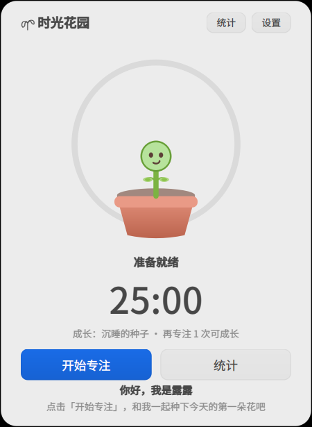
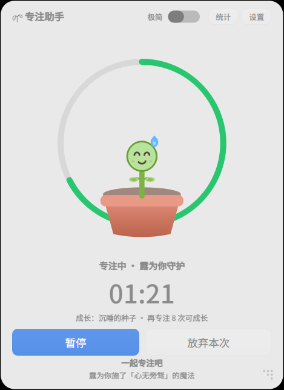

# 🌱 专注助手 Focus Assistant

> 一棵住在你桌面角落、**随你的专注而成长**的小植物「露露」——你的桌面专注助手。

**deepin Skills 开发大赛参赛作品** · 方向三：DTK 原生应用（`dtk-development`）
基于 deepin 25 / UOS v25，DTK6 + Qt6（C++/Qt Widgets），纯矢量自绘无外部素材。



---

## ✨ 创意与亮点

- **养成驱动专注**：认真完成一段番茄钟，花盆里的“露露”就会长大——
  种子 → 幼苗 → 含苞 → 盛放（按累计专注时长进阶，进度实时显示）。
- **会累、会困、会开心**：专注时露露“认真脸 + 汗滴”，到了休息时间它会闭眼打盹（zZz），
  完成专注会撒花庆祝；它还会在你连续工作多轮后主动提醒你休息。
- **系统联动（真实可靠、默认关闭，设置中可开启）**：专注开始自动开启 **护眼模式（DDE 色温）**，
  结束/进入休息自动还原，且退出应用/异常崩溃都会自动清理，绝不残留系统状态 ——
  通过 `org.deepin.dde.Display1` 的 `SetColorTemperature` + `ColorTemperatureEnabled` 实现
  （色温值属只读属性，不直接写入），并适配“用户原本开着夜间/自定义色温则不打扰、不改动其数值”的场景。
- **低打扰常驻**：无边框毛玻璃小窗 + 系统托盘；按住露露即可拖动窗口，
  双击露露快速开始/暂停；关闭窗口收进托盘继续守护。
- **可大可小**：窗口支持**自由缩放**——把鼠标移到窗口任意边缘/四角即可拖拽调大小
  （悬停有箭头光标，右下角有三点提示），露露按 300×250 虚拟画布**等比缩放**跟着变大变小，
  尺寸自动记忆，下次启动恢复原样。
- **极简模式**：需要更专注时可在**设置 / 托盘菜单**开启「极简模式」——只剩露露花朵和专注进度环，
  **白色面板全部变透明**，像悬浮在桌面上一样不打扰视线；右键露露（或托盘菜单）即可恢复完整界面，
  双击露露开始/暂停、拖动换位置在极简模式下同样可用。
- **本地优先**：所有统计（今日/最近 7 天/累计专注、完成次数、成长阶段）
  保存在 `~/.config/focus-assistant/`，无任何联网与隐私收集。



## 🎯 功能清单

| 模块 | 说明 |
| --- | --- |
| 番茄钟 | 15/25/45/60 分钟可选；开始/暂停/继续/放弃 |
| 劳逸节奏 | 短休息 5–15 分钟，长休息每 N 次触发（可配），自动进入休息可开关 |
| 养成系统 | 4 形态成长（按累计专注分钟），界面显示距下一形态还需几次；露露实时长大 |
| 情绪动画 | 呼吸、眨眼、认真脸、困倦 zZz、撒花庆祝、成长演出 |
| 皮肤 | 经典粉花·露露 / 阳光向日葵（PVZ 风格双层花瓣+招牌表情），**右键露露**或**托盘→换肤**即点即换并本地保存，设置中也可切换 |
| 护眼联动 | 专注联动护眼色温，结束自动还原（默认关闭，设置中开启；退出/崩溃自动清理） |
| 桌面常驻 | 勾选后窗口以置顶方式常驻桌面，「显示桌面」也不会被隐藏（X11 下通过 override-redirect 实现，托盘一键开关） |
| 自由缩放 | 无边框手动缩放：拖拽任意边缘/四角放大缩小（可大可小），露露等比缩放不拉伸变形，最小约 230×330（逻辑像素），尺寸自动记忆 |
| 极简模式 | 只显示露露与专注进度环，白色面板完全透明（悬浮桌面小部件）；右键露露或托盘/设置可随时切换，状态自动记忆 |
| 统计 | 今日 / 累计 / 完成次数 / 成长阶段 / 最近 7 天柱状图 |
| 托盘 | 隐藏/显示、快速开始/暂停、成长记录、退出 |
| 数据 | QSettings 本地持久化，跨天自动重置“连续专注” |

## 🖥️ 运行环境

- deepin 25 / UOS v25（X11 已验证；Wayland 会话下核心功能正常，窗口装饰以合成器能力为准）
- amd64 / arm64（纯 C++ + Qt6/DTK6，跨架构无特殊代码）
- 运行时依赖：`libdtk6core libdtk6gui libdtk6widget libqt6core6 libqt6gui6 libqt6widgets6 libqt6dbus6`

## 🔧 构建

```bash
# 编译依赖
sudo apt install build-essential cmake ninja-build git \
  qt6-base-dev qt6-declarative-dev libdtk6widget-dev libdtk6core-dev libdtk6gui-dev

git clone <repo-url> focus-assistant
cd focus-assistant
cmake -B build -G Ninja -DCMAKE_BUILD_TYPE=Release
ninja -C build
```

## 📦 安装 / 卸载

```bash
# 方式一：直接安装到系统
sudo ninja -C build install        # 卸载: sudo ninja -C build uninstall

# 方式二：生成并安装 .deb（推荐，便于干净卸载）
cmake -B build -G Ninja -DCMAKE_INSTALL_PREFIX=/usr
cpack -G DEB -C Release --config build/CPackConfig.cmake
sudo apt install ./focus-assistant-1.0.0-amd64.deb   # 卸载: sudo apt remove focus-assistant
```

安装后可在启动器搜索 **专注助手 / Focus Assistant** 启动。

## 🎮 使用

1. 点击 **开始专注**：露露进入“守护”状态，倒计时环（如在设置中开启护眼联动，会自动开护眼色温）；
2. 专注结束自动进入休息，露露打盹（可跳过）；
3. 连续完成 N 轮触发长休息，帮助恢复精力；
4. 随时打开 **统计** 查看 7 天柱状图与成长进度；
5. 右键托盘图标 → 退出。

> 贴心小操作：**按住露露拖动**可以把它放到桌面上任意喜欢的位置，
> **双击露露**快速开始/暂停一段专注，**右键露露**或**托盘 → 换肤 · 露露的皮肤**随时自选皮肤。
> **桌面常驻**：设置中勾选「桌面常驻：不受「显示桌面」影响」，或在**托盘菜单勾选「桌面常驻」**——开启后露露会一直待在桌面上（置顶），按“显示桌面/回到桌面”也不会消失；取消勾选即恢复普通窗口。

## 🏗️ 代码结构

```
src/
├── main.cpp          入口：DApplication、单实例逻辑组装
├── focusmanager.*    专注状态机：Idle/Focus/Pause/Break、成长与统计持久化
├── petwidget.*       露露：纯 QPainter 矢量绘制 + 呼吸/眨眼/庆祝粒子动画
├── mainwindow.*      无边框半透明主窗、托盘、按钮与文案联动、设置对话框
├── statsdialog.*     成长记录：汇总指标 + 最近 7 天柱状图
└── systemlinker.*    系统联动：护眼色温开关/还原 + 崩溃残留清理（Display1）、桌面通知
resources/            SVG 应用图标（亦作为托盘/窗口图标）
data/                 .desktop 启动器入口
docs/screenshots/     演示截图
```

## 🧩 本项目如何使用 deepin Skills 开发

- 使用 **`dtk-development`** 技能获取 DTK6 工程模板（CMake / main / .desktop）、
  D-Bus（DDBusSender）、DConfig 权限边界、平台抽象层等规范文档；
- 按技能模板搭建 `Dtk6::Core/Gui/Widget` 标准工程，避免混用 DTK5/Qt5 与 DTK6/Qt6；
- 依据技能中“第三方应用不可写其他应用 DConfig”的结论，将 **勿扰（DND）自动切换**
  从 v1 移除并列为 Roadmap，保证功能可靠与安全；
- 依据 `dde 色温属性（ColorTemperatureEnabled/Manual）` 探测结果实现护眼联动；
  注意 `ColorTemperatureManual` 为只读属性，必须调用 `SetColorTemperature` 方法写入色温值，
  而非直接 setProperty（v1.0.1 修复）；护眼联动默认关闭，避免影响桌面其它界面。

## 🗺️ Roadmap（未来迭代）

- 勿扰联动：待 dde-shell 开放公开 D-Bus/权限后接入（v1 因第三方权限边界暂缓）
- 全局快捷键快速开始/暂停；专注时自动隐藏消息弹层
- 云同步/多端成长；更多露露形态与季节皮肤
- 与全局搜索、控制中心插件组合扩展

## 📄 License

[GPL-3.0](LICENSE)
